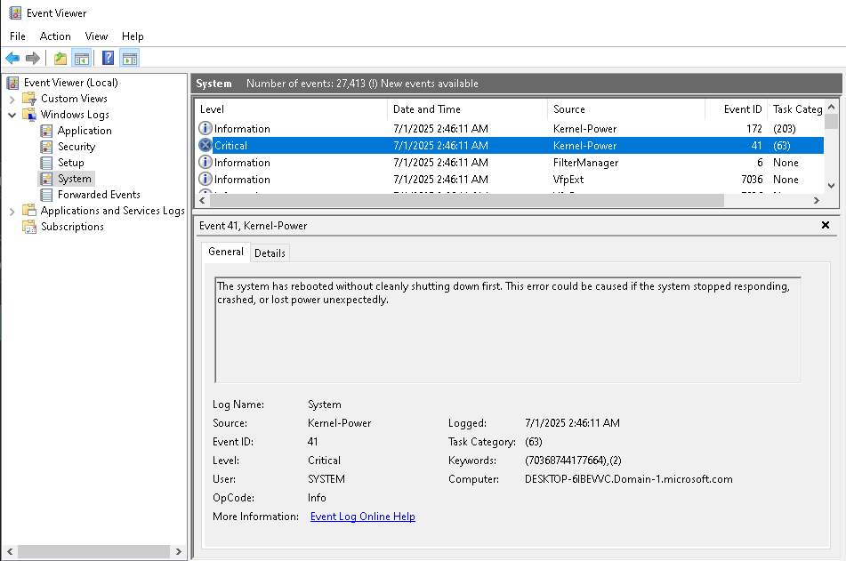

# windows-event-viewer

# 🖥 Windows Event Viewer

This repository explore's **Windows Event Viewer** as part of a project on my Portfolio.   

The guide provides a structured, visual reference for diagnosing common Windows system, application, and security issues using Event Viewer.

---

## 📖 Overview

Event Viewer is a core tool for IT professionals to diagnose and troubleshoot Windows environments.  

This lab is designed as an **educational reference**, showing how to interpret specific Event IDs and where to locate them across the different Event Viewer logs.

The included HTML page organizes **Event IDs by category**, along with screenshots of actual logs to help identify root causes quickly.

---

🖥️ **Live Project Webpage:**  
👉 [Event Viewer Lab](https://mark-thompson01.github.io/MTPortfolio/Current%20Projects%20&%20Studies/Windows%20Event%20Viewer/)

This guide explores navigating different Event ID's in Windows Event Viewer for troubleshooting different issues.

---

## 🔍 What I've Learned

- How to navigate **Event Viewer** and locate logs by category  
- How to identify and interpret common **Event IDs** for:
  - System crashes & unexpected reboots
  - Application crashes & hangs
  - User logon/logoff issues
  - Windows Update problems
  - Group Policy processing errors
  - Performance bottlenecks (slow boot/login)
  - Driver/service failures
  - Malware/security incidents
  - Print job and spooler errors
- Best practices for using Event Viewer effectively:
  - Filtering logs
  - Correlating events across multiple logs
  - Exporting logs for further analysis

---

## 📁 More from Me

Visit my full GitHub Pages portfolio to explore additional projects:

🔗 [MTPortfolio – Full Project Index](https://mark-thompson01.github.io/MTPortfolio/)

---

## 📜 License

This project is licensed under the 
[Creative Commons Attribution 4.0 International License (CC BY 4.0)](https://creativecommons.org/licenses/by/4.0/).

You are free to use, share, and adapt this content, with appropriate credit.

